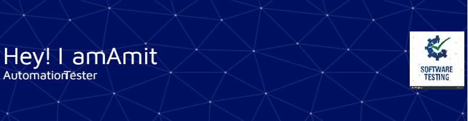

<h1 align="center">Hi 👋, I'm Amit Kumar</h1>
<h3 align="center">Software Quality Assurance Engineer.Experienced in Automation Testing with java and selenium from India.</h3>

- 🔭 I’m currently working on **Java Selenium**

- 🌱 I’m currently learning **Java, Selenium, TestNG, API testing wihPostman**

- 💬 Ask me about **Java, Automation Testing, Web development**

- 📫 How to reach me **amitkumar970522@gmail.com**

<h3 align="left">Connect with me:</h3>

<h3 align="left">Languages and Tools:</h3>

         

